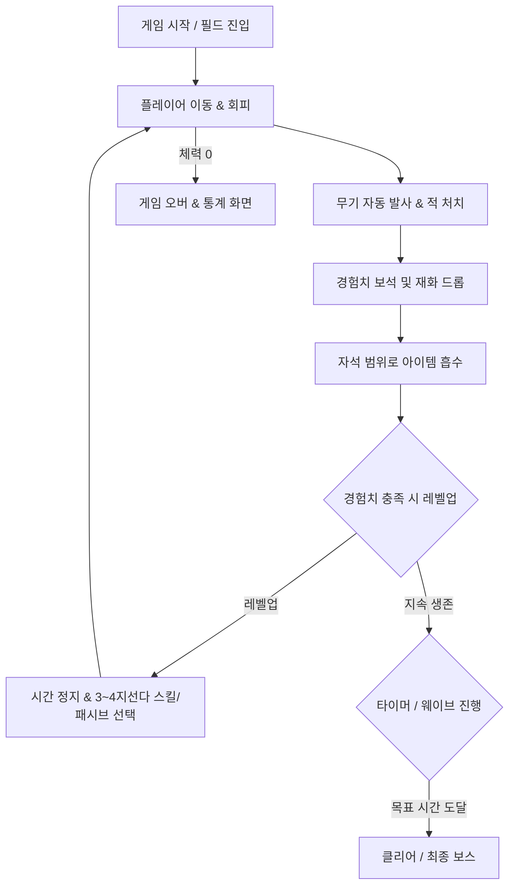

# [PRD] 뱀서라이크(Horde Survival) 게임 기획서

## 1. 프로젝트 개요 (Overview)
- **프로젝트명**: 뱀서 (가칭)
- **장르**: 2D 로그라이트 탄막 생존 (Horde Survival / Bullet Heaven)
- **개발 엔진**: Godot 4.x (GDScript)
- **타깃 플랫폼**: PC (Windows / macOS), 추후 모바일 확장 고려
- **핵심 컨셉**: 
  - **극단적으로 단순한 조작**: 플레이어는 **이동**만 조작하고, 모든 공격은 **자동**으로 발동.
  - **대규모 적 처치와 쾌감**: 사방에서 몰려오는 수백~수천 마리의 몬스터를 학살하는 쾌감.
  - **로그라이트 성장**: 매 레벨업마다 무작위로 주어지는 무기/패시브를 조합해 나만의 시너지 빌드 완성.

---

## 2. 핵심 게임 루프 (Core Game Loop)

---

## 3. 핵심 기능 요구사항 (Feature Requirements)

### 3.1. 플레이어 (Player)
- **조작**: 8방향 이동 (키보드 `WASD` 또는 방향키)
- **기본 스탯**:
  - 최대 체력 (Max HP), 현재 체력 (Current HP)
  - 이동 속도 (Move Speed)
  - 픽업 반경 (Magnet/Pickup Range)
  - 공격력 배율 (Might), 쿨다운 감소 (Cooldown Reduction)
- **피격 판정**: 적과 충돌 시 지속/주기적 데미지 및 짧은 무적 시간(i-frame) 부여

### 3.2. 무기 및 자동 전투 시스템 (Weapons & Combat)
- **자동 공격 메커니즘**:
  - 공격 버튼 없이 타이머(Cooldown)에 따라 독립적으로 자동 발사/발동.
- **초기 무기 유형 예시**:
  1. **직사 투사체 (단검/매직 미사일)**: 가장 가까운 적을 향해 발사.
  2. **회전체/오라 (성서/마늘)**: 플레이어 주변을 회전하거나 근접 영역에 지속 데미지.
  3. **범위 폭격 (성수/도끼)**: 무작위 적 위치 또는 포물선 궤적으로 광역 폭발.
- **슬롯 제한**:
  - 액티브 무기 최대 4~6개
  - 패시브 장신구 최대 4~6개
- **무기 업그레이드**:
  - 무기별 최대 8레벨 (공격력 증가, 투사체 수 증가, 범위 증가 등)

### 3.3. 몬스터 및 스폰 시스템 (Enemies & Spawner)
- **AI**: 플레이어의 현재 위치를 향해 최단 거리로 단순 추적 (Swarm AI).
- **웨이브(Wave) 시스템**:
  - 생존 시간에 따라 스폰 주기, 몬스터 종류, 체력/이동속도 점진적 증가.
  - 시간대별 이벤트 (예: 3분 박쥐 떼 돌진, 5분 미니보스 출현 등).
- **최적화 요구**:
  - 화면 내 100~500+ 이상의 몬스터가 등장하므로 **오브젝트 풀링(Node Pooling)** 필수 적용.

### 3.4. 드롭 및 레벨업 시스템 (Drop & Level Up)
- **드롭 아이템**:
  - 경험치 보석(Gem): 색상별 차등 경험치 (파랑/초록/빨강).
  - 골드/코인: 메타 성장을 위한 재화.
  - 회복 아이템: 소량 체력 회복.
  - 특수 아이템: 화면 전체 처치 폭탄, 전체 흡수 자석 등.
- **레벨업 연출**:
  - 경험치 게이지 100% 도달 시 게임 일시정지(`get_tree().paused = true`).
  - 보유 중인 장비와 신규 장비 풀에서 3~4개의 카드를 무작위 제시.
  - 카드 선택 시 즉시 효과 적용 후 게임 재개.

### 3.5. UI / UX
- **인게임 HUD**:
  - 상단: 경험치 바(Level 진행도), 생존 타이머
  - 좌측 상단/플레이어 위: 플레이어 HP 바
  - 우측 상단: 처치 수(Kill Count), 획득 골드
  - 하단/인벤토리: 현재 장착 중인 무기 및 패시브 아이콘과 레벨 표시
- **결과 화면**:
  - 생존 시간, 최종 레벨, 총 킬 수, 획득 골드, 무기별 딜량 통계(Damage Graph)

---

## 4. MVP (최소 기능 제품) 개발 단계 계획

| 단계 | 목표 | 세부 구현 내용 |
| :--- | :--- | :--- |
| **Phase 1: 기본 프로토타입** | 이동과 기본 전투 | • 플레이어 이동 및 카메라 추적 • 가장 가까운 적을 쏘는 단일 무기 1종 • 플레이어로 걸어오는 기본 몬스터 스폰 |
| **Phase 2: 루프 완성** | 파밍과 레벨업 | • 몬스터 처치 시 경험치 드롭 및 자석 흡수 • 레벨업 팝업 UI 및 스킬 3종 업그레이드 선택지 • 플레이어 HP 및 피격/게임 오버 처리 |
| **Phase 3: 콘텐츠 확장** | 무기 다각화 및 웨이브 | • 무기 4종 / 패시브 3종 추가 • 시간별 웨이브 스폰 테이블 구성 • 오브젝트 풀링을 통한 최적화 |
| **Phase 4: 완성도 향상** | 시각/청각 피드백 | • 피격 폰트(Damage Numbers), 화면 흔들림(Screen Shake) • BGM 및 SFX 효과음 적용 |

---

## 5. Godot 4 기술 설계 가이드

- **아키텍처**:
  - **데이터 주도 설계 (Resource)**: 무기와 몬스터 스탯을 `Resource` (`.tres`)로 정의하여 코드 변경 없이 기획 수치 조정 가능하게 설계.
  - **이벤트 버스 (Autoload EventBus)**: `player_damaged`, `enemy_died`, `level_up` 등의 이벤트를 싱글톤 Signal로 관리하여 노드 간 결합도 완화.
  - **성능 최적화**: 몬스터와 발사체는 `queue_free()` 빈번 호출을 피하고 Pool Manager를 통해 재사용.
